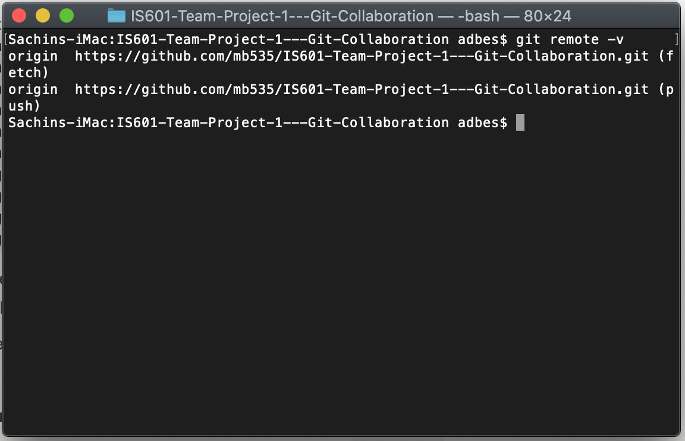
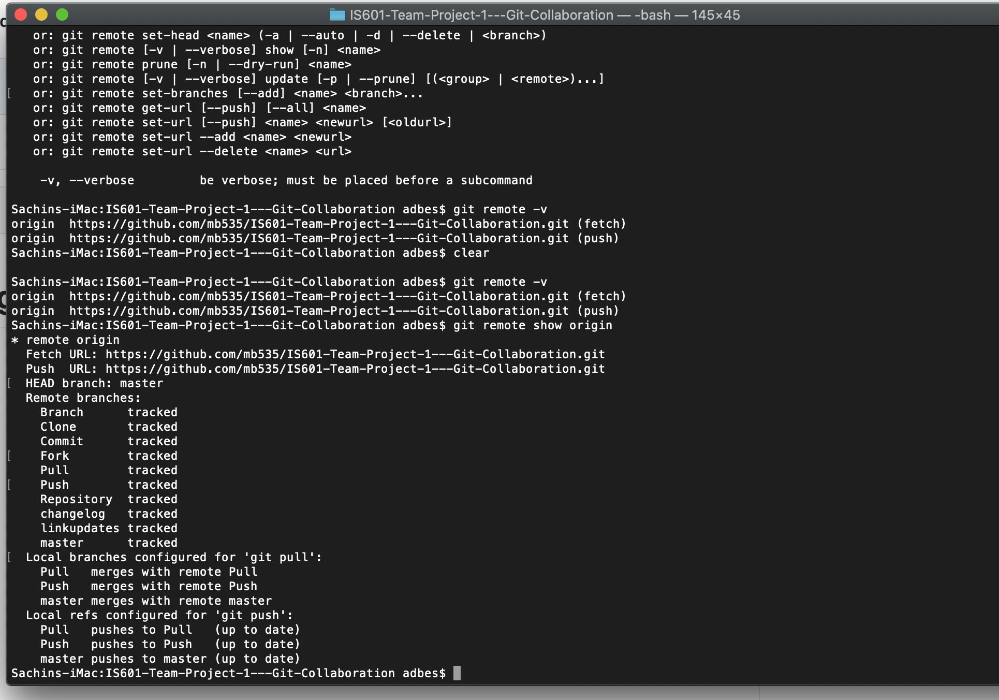

# Definition
     To collaborate effectively using Git, we must be able to effecitvely manage remote repositories. REmote repositories
      are versions of the code that are are hosted elsewhere. In this course, we are using a team member's repository
     hosted on GitHub.
     
 ## Git Remote
    The git clone command automatically adds the *origin* remote. So, when we cloned the repository to work on our tasks, 
    as seen below, the remote was automatically added.
    
  
    
  ## Git Remote Add
    Git Clone automatically adds a remote origin. To explicitly add a new remote Git repository, use the following command:
    
    git remote add <shortname> <url> 
    
  ## Git Remote Show
  
  Git Remote Show is used to view more information about a particular remote. It lists the URL of the remote repository
  as well as the tracking branch informaion.
  
  
    
  ## Git Remote Remove
    Use the git remote rm command to remove a remote URL from your repository. 
    
    The git remote rm command takes one argument:
    
    A remote name, for example, destination
    
    Note that the command does not physically delete the remote repository, only the local remote and references. 